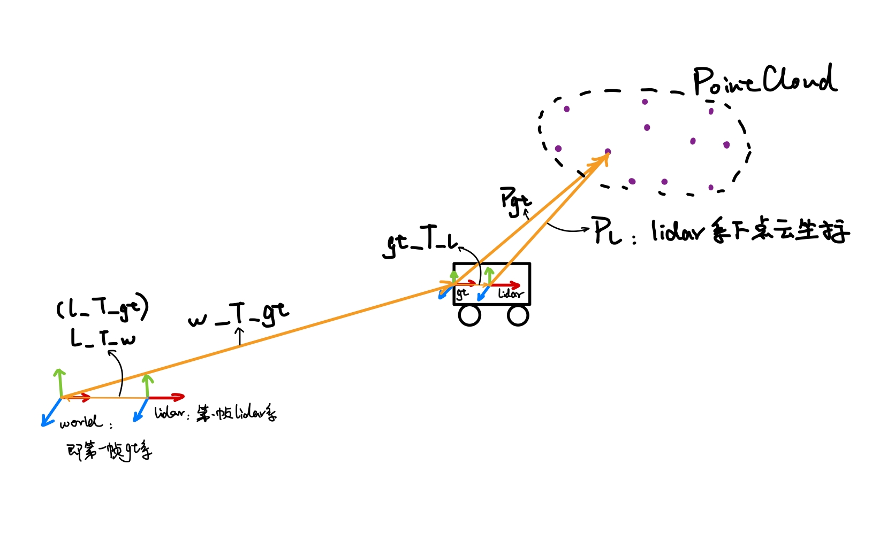

# Block_Map_from_Groundtruth

A package for generating Block Maps (BMs) using the ground-truth.

The dataset directory has to follow this structure: 
```angular2html
Block-SLAM
├── gt
│   └── nclt
│       ├── 20120115
│       │   ├── groundtruth_2012-01-15.csv
│       │   └── gt_2012-01-15.txt
│       ├── 20120429
│       │   ├── groundtruth_2012-04-29.csv
│       │   └── gt_2012-04-29.txt
│       └── 20130110
│           ├── groundtruth_2013-01-10.csv
│           └── gt_2013-01-10.txt
├── map
│   └── nclt
│       ├── 20120115
│       ├── 20120429
│       └── 20130110
```

The following image illustrates the details of the transformation in this mapping algorithm.

<div align="center">

</div>